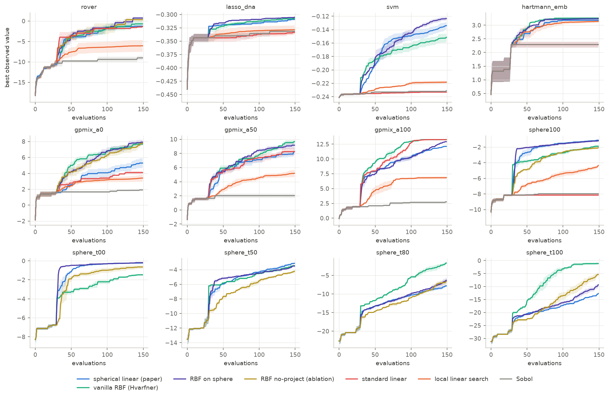
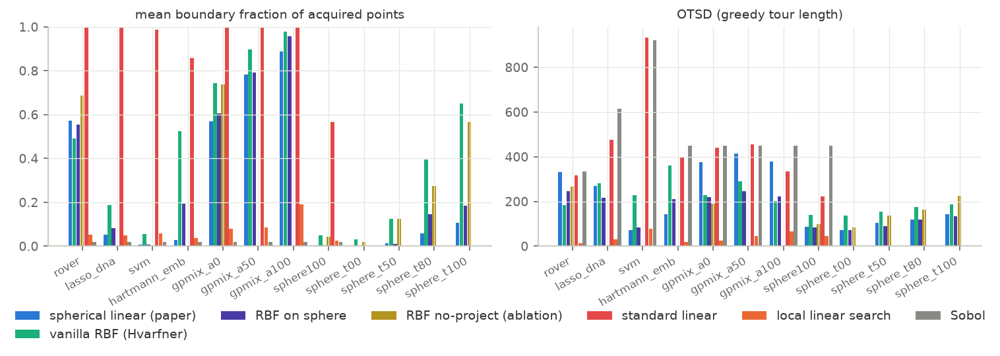
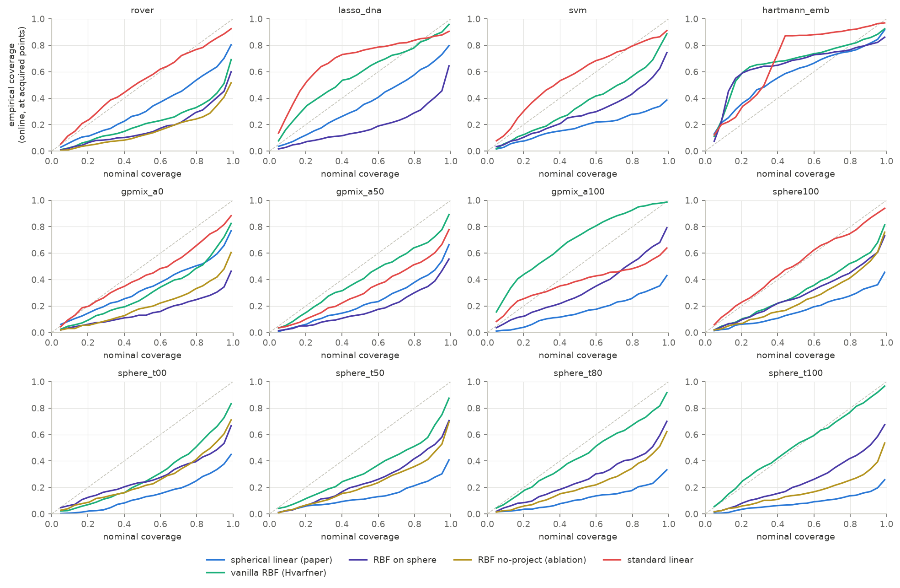
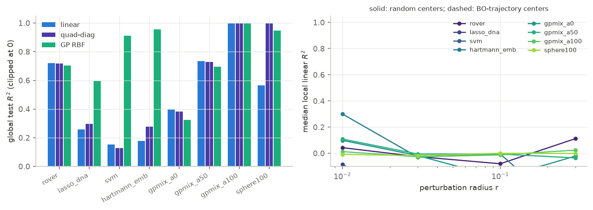
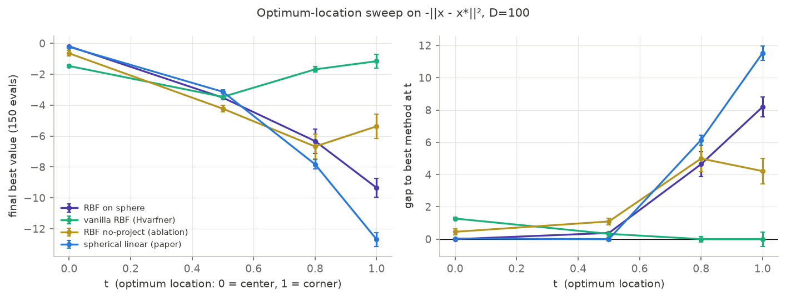
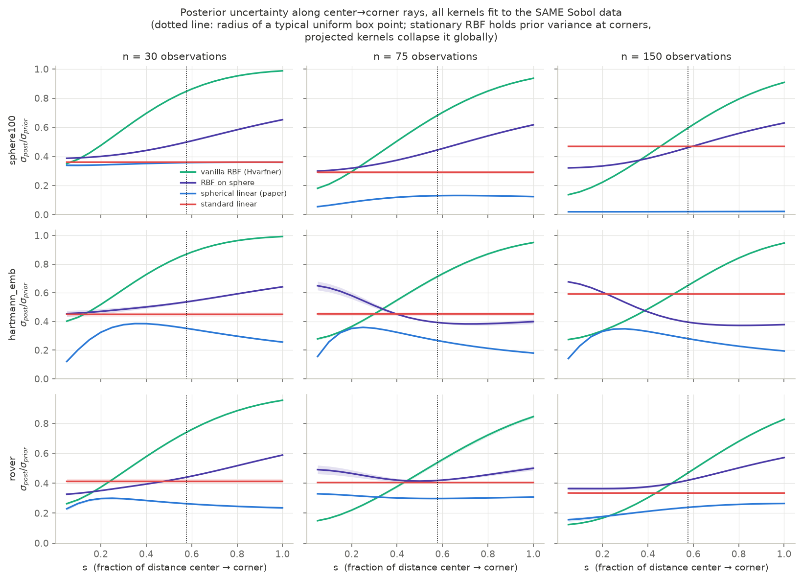

## Preamble

This post was the result of me putting Claude Fable to the test in early July
when it was made available to the public again and was included in my personal
Claude Pro subscription. I gave it a question and some hypotheses about a paper
that had been on my radar for a while, and it ran experiments and produced the
report below. I reviewed it with roughly the same thoroughness that I would review
an ML conference paper (NeurIPS/ICML/ICLR/similar): I've looked at the experiments
and results and judged them to be reasonable, but did not dig into the code myself.

The actual scientific takeaway is as follows: the reason linear BO with an
inverse stereographic projection works well on benchmarks is mostly because
of the projection, which implicitly gives a mild inductive bias towards
the optimum being in the center (at least for a linear model). The linear
model seems to not be the key ingredient.

Of course, the analysis below is on cheaper experiments, so could be extended
and made more robust.

::: {.callout-tip}
## Seeking collaborators

If any students want to take these results and extend it into a paper, I'm
happy for somebody to take the lead! I don't have time to turn this into a
strong paper myself. If you are interested, feel free to email me 🙂

:::

::: {.callout-caution}
## Content below is ≈100% AI generated

Even though it's on my blog, it's not my writing, so I don't necessarily
endorse every word of it. I didn't feel I had time to edit and check it
in great detail (otherwise I would just turn this into a paper myself),
but thought it was high quality enough to put online rather than let it
sit indefinitely on my hard drive.

:::

---

## Introduction

**Question.** The paper [*We Still Don't Understand High-Dimensional Bayesian Optimization*](https://arxiv.org/abs/2512.00170) shows that Bayesian linear regression — after inverse-stereographic projection of lengthscale-scaled inputs onto the unit sphere — matches highly-engineered HDBO methods. Why? Three candidate hypotheses were tested:

- **H1** — all methods are bad; the linear one suffers the fewest pathologies.
- **H2** — the linear model wins through better *calibration*.
- **H3** — the benchmarks are close to linear, so the linear prior happens to fit.

**Verdicts (details below):**

| Hypothesis | Verdict | One-line summary |
|---|---|---------|
| H1 (fewest pathologies) | **Supported, with a mechanism** | The projection removes the boundary/corner pathology; beyond that, *any* sane surrogate ties in the $N \approx D$ regime. The active ingredient is the projection pipeline, not linearity: RBF-on-sphere ≥ spherical-linear everywhere we tested. |
| H2 (calibration) | **Refuted** | Spherical-linear wins *while being the most overconfident model online* (z-std 2.3–8.8, 90%-interval coverage 32–66%). The catastrophically failing standard linear kernel is often the *best*-calibrated. |
| H3 (benchmarks near-linear) | **Partially supported, in a refined form** | Some benchmarks are globally quite linear (rover $R^2 = 0.72$), others are not at all (SVM $R^2 = 0.15$) yet linear still ties. The refined claim: at $N \approx D$ sample sizes, capacity beyond $\sim D$ parameters is unusable, and dimension-scaled smoothness priors make even "nonlinear" objectives substantially linear over the search box. Linear is *sufficient for the data budget*, not a match to the functions. |

Plus two mechanistic findings not in the paper (derivations in §5, direct experimental tests in §6): **the spherical projection secretly grants the "linear" model an isotropic-quadratic (bowl) feature**, which is what lets it converge to interior optima at all; and for RBF it is a **conformal compactification of the metric** that deletes the boundary exploration bonus of stationary kernels. Both amount to a *prior that the optimum is interior* — slide the optimum to a corner and the projected methods become the worst in the pool while "pathological" vanilla RBF becomes the best (§6a).

---

## 1. Setup

Six methods, all sharing the paper's BO loop (LogEI, MLE refits, Sobol init 30):

| method | model | purpose |
|---|------|------|
| `spherical_linear` | the paper's kernel | the method under investigation |
| `standard_linear` | same kernel, projection removed | the paper's failing baseline (Theorem-1 regime) |
| `vanilla_rbf` | RBF ARD, Hvarfner dimension-scaled prior | the strong conventional baseline |
| `rbf_sphere` | RBF applied *after* the same projection pipeline | **isolates projection geometry from linear function class** |
| `rbf_noproject` | rbf_sphere's pipeline with the projection switched off | isolates the projection from the pipeline's hyperpriors (§6b) |
| `local_linear` | non-Bayesian: ridge fit on neighbors + trust-region gradient step | is the Bayesian machinery doing anything? |
| `sobol` | quasi-random | failure floor |

Benchmarks: three real (rover 60D, lasso-DNA 180D, SVM 388D) and five synthetic controls with *known* structure: `hartmann_emb` (Hartmann-6 in 100D: sparse, nonlinear), `gpmix_a{0,50,100}` (100D GP draws with an exact linear-variance fraction $\alpha \in \{0, 0.5, 1\}$), `sphere100` (interior quadratic bowl: zero linear signal at the optimum), and `sphere_t{00,50,80,100}` (bowl with the optimum slid from box center to a corner — the §6a sweep). 3 seeds × 150 evaluations each (trimmed from the paper's 1000 — see Limitations). Offline linearity probes use ~2000 extra evaluations per benchmark. All 202 runs completed with **zero model-fit failures for any method** — whatever goes wrong in HDBO here is behavioral, not numerical.

Final best values (mean over seeds; ± is SEM):

| benchmark | spherical_linear | vanilla_rbf | rbf_sphere | standard_linear | local_linear | sobol |
|---|---|---|---|---|---|---|
| rover | −1.28 ±0.41 | −0.70 ±0.88 | **+0.73 ±0.37** | −1.35 ±0.03 | −6.06 | −9.03 |
| lasso_dna | −0.309 | −0.307 | **−0.305** | −0.333 | −0.328 | −0.331 |
| svm | −0.134 ±0.006 | −0.151 ±0.008 | **−0.124 ±0.003** | −0.233 | −0.218 | −0.231 |
| hartmann_emb | 3.18 | 3.26 | 3.24 | 2.29 | 3.14 | 2.29 |
| gpmix_a0 (nonlinear) | 5.29 ±0.75 | 7.68 ±0.19 | **7.92 ±0.39** | 4.09 | 3.40 | 1.91 |
| gpmix_a100 (linear) | 12.12 | **13.26** | 12.91 | **13.26** | 6.84 | 2.76 |
| sphere100 (bowl) | **−1.12 ±0.09** | −1.90 ±0.23 | −1.21 ±0.08 | −8.15 | −4.36 | −7.97 |

---

## 2. H1: pathologies — supported, and sharpened

**The standard linear kernel has exactly the pathology the paper's Theorem 1 predicts, and it is fatal only when the optimum is interior.** Its boundary fraction is ≈1.00 on every benchmark (figure below); its max-LogEI collapses (to −250 on sphere100 — the acquisition is *dead*, points are chosen by boundary-inflated variance alone); its OTSD on SVM (934) is indistinguishable from random search (921). Consequences track the geometry of the optimum exactly: on `sphere100` (interior optimum) and SVM it performs *at the Sobol floor*; on `gpmix_a100`, whose optimum genuinely lies at a corner because the function is linear, corner-seeking is optimal and standard linear is the **best** method. The pathology is not "linear models are bad" — it is "linear models hard-code the assumption that the optimum is at a corner."

**Beyond removing that one pathology, the field is flat.** On all three real benchmarks and hartmann_emb, the three non-pathological GP surrogates (spherical-linear, vanilla RBF, RBF-on-sphere) are within ~2 SEM of each other. No baseline exhibited a crash, lengthscale collapse, or vanishing-EI failure — vanilla RBF's fitted lengthscales sit stably near the prior mode. In this budget regime the "highly engineered methods vs simple methods" contrast largely evaporates once nobody is corner-seeking.

**The most discriminative result in the whole study:** `rbf_sphere` ≥ `spherical_linear` on effectively every benchmark, dramatically so on the genuinely nonlinear control (gpmix_a0: 7.92 vs 5.29). Per the pre-registered interpretation matrix, this says the **active ingredient is the projection + decoupled-lengthscale pipeline, not the linear function class**. Linearity is not the source of the paper's success — it is the *price* the paper pays (cheerfully, since it buys $O(ND^2)$ scaling and exact Thompson sampling), and in the $N \approx D$ regime the price is ≈ zero.

**The Bayesian machinery is not incidental.** The non-Bayesian `local_linear` baseline — which shares the "fit a linear model, follow its gradient" heart of the method but has no posterior and no EI — loses badly everywhere (e.g. rover −6.1 vs −1.3; it cannot even solve hartmann_emb, final 3.14 only after getting stuck at the Sobol plateau). Pure locality is also not the mechanism: `local_linear` has the *smallest* OTSD of all methods and still fails, while spherical-linear's OTSD is actually *higher* than vanilla RBF's on 5 of 8 benchmarks (contrary to the paper's "similarly local" reading — at least at this budget, spherical-linear explores more globally than RBF, not equally locally).

## 3. H2: calibration — refuted

Online reliability (does the model's predictive interval at the point it *chooses* cover the value it then *observes*?):

The pattern is the opposite of H2. **Spherical-linear is the most miscalibrated method in the pool** — online z-score std between 2.3 (rover) and 8.8 (SVM), 90%-interval coverage as low as 32% — and it wins anyway. Vanilla RBF is consistently the best-calibrated (z-std 0.65–1.8) and does not win because of it. Most damning: **standard linear is often closest to the diagonal** (z-std ~1.7, coverage ~85% on rover/svm/lasso) *while performing at the random-search floor* — its enormous boundary-point variances honestly cover its enormous errors. Honest uncertainty about bad predictions does not optimize functions. There is also no dissociation of the kind that would rescue H2 (well-calibrated online / poorly calibrated globally): the online-vs-holdout NLL scatter shows spherical-linear among the worst on *both* axes on several benchmarks it wins (online NLL ≈ 59 std-units on rover, ≈ 31 on sphere100).

If anything, the data suggest mild *overconfidence helps*: the winning methods systematically under-cover at acquired points, i.e. they exploit their (locally decent) mean estimates more aggressively than their posteriors justify.

## 4. H3: benchmark linearity — partially supported, in a refined form

Offline probes (ridge test-$R^2$ on ~2000 Sobol points, vs a quadratic-diagonal fit and a vanilla-RBF GP reference):

| benchmark | $R^2$ (linear) | $R^2$ (GP-RBF) | linear "enough"? |
|---|---|---|-----|
| rover | 0.72 | 0.70 | globally — yes, fully |
| gpmix_a50 | 0.74 | 0.70 | yes (by construction, α=0.5 → but see below) |
| **gpmix_a0** | **0.40** | 0.33 | "fully nonlinear" control is 40% linear! |
| sphere100 | 0.57 | 0.95 | linear part = off-center bowl's tilt |
| lasso_dna | 0.26 | 0.60 | no |
| hartmann_emb | 0.18 | 0.96 | no |
| svm | 0.15 | 0.91 | no |

Three observations replace the naive version of H3:

1. **H3-naive is false.** SVM, lasso-DNA and hartmann_emb are strongly nonlinear and *learnably* so (an RBF GP reaches $R^2$ 0.60–0.96 with 1600 points), yet spherical-linear ties or beats vanilla RBF on all three BO tasks. Global linearity of the objective is not necessary for the linear surrogate to compete.

2. **The "nonlinear" regime everyone tests in is substantially linear anyway.** `gpmix_a0` is a *pure RBF-kernel draw* using the standard dimension-scaled lengthscale ($\ell \propto \sqrt{D}$) — the convention that modern HDBO (Hvarfner, and this paper) is built on — and a plain linear model explains 40% of its variance over the whole box. With $\ell \sim \sqrt{D}$ and box diameter $\sim \sqrt{D}$, GP draws vary by $O(1)$ across the reachable domain and are dominated by their low-order components. This directly reframes the paper's α-mix ablation: their method "still making progress at α = 0" is less surprising when α = 0 functions are two-fifths linear. The smoothness convention that fixed high-dimensional BO also quietly *linearized* it.

3. **What fails is capacity you cannot use.** At $N \approx D \approx 150$ observations in 60–388 dimensions, no surrogate can identify more than $\sim D$ effective parameters; the linear model has exactly $D+2$. Where extra capacity *could* be exploited within budget (gpmix_a0, where the RBF variants beat linear by ~2.5 units), linearity has a real cost — visible only because the synthetic control isolates it. On the real $N \approx D$ benchmarks the cost is invisible. H3, refined: *the benchmarks aren't linear — the evaluation budget is.*

The "EI acquires where local Taylor suffices" conjecture from the paper found no support: local linear fits at the step sizes the methods actually take (median 0.5–3.0 in normalized units) have $R^2 \approx 0$ on every benchmark, with ~30 local samples (the honest in-BO sample size). The linear model's edge is a global trend + one global bowl (next section), not local gradient estimation.

## 5. The overlooked mechanism: what the projection actually does

The projection turns out to give the two kernels two *different* gifts, and both are derivable in closed form. Throughout, $z = (x - \tfrac{1}{2})/\ell$ denotes the centered, ARD-lengthscale-scaled input, and the inverse-stereographic map is

$$
P(z) \;=\; \frac{1}{\lVert z\rVert^2 + 1}\begin{bmatrix} 2z \\ \lVert z\rVert^2 - 1 \end{bmatrix} \in \mathbb{R}^{D+1},
\qquad \lVert P(z)\rVert = 1 \text{ identically.}
$$

### 5a. For the linear kernel: a bowl feature (weight-space derivation)

A GP with a linear kernel in features $\varphi$ is exactly Bayesian linear regression on those features: every sample is $f(z) = w^\top \varphi(z)$ with Gaussian $w$. Here $\varphi = P$, so writing $w = (v, c)$ — first $D$ weights and the last one —

$$
f(z) \;=\; \frac{2 v^\top z + c\,(\lVert z\rVert^2 - 1)}{\lVert z\rVert^2 + 1}.
$$

The last coordinate of $P$ is $g(\lVert z\rVert^2)$ where

$$
g(s) = \frac{s - 1}{s + 1}:
$$

a monotone, saturating (range $(-1, 1)$), *radially symmetric* feature of the input — it depends on $z$ only through its norm. That single extra feature is the whole story. Completing the square in the numerator (for $c \neq 0$):

$$
2 v^\top z + c\lVert z\rVert^2 - c \;=\; c\left( \Big\lVert z + \tfrac{v}{c}\Big\rVert^2 - \tfrac{\lVert v\rVert^2}{c^2} - 1 \right),
$$

so with $c < 0$ the model represents a **downward bowl whose center $-v/c$ and depth are set by learned weights** — an interior maximum placeable anywhere. In the small-norm regime, expanding $1/(1+\lVert z\rVert^2) \approx 1 - \lVert z\rVert^2$ gives $f(z) \approx -c + 2v^\top z + 2c\lVert z\rVert^2 + O(\lVert z\rVert^3)$: linear plus isotropic quadratic, to leading order. Three refinements:

- "Isotropic" is in $z$-space; since $\lVert z\rVert^2 = \sum_i (x_i - \tfrac{1}{2})^2/\ell_i^2$, in original coordinates the bowl is an *axis-aligned ellipsoid* shaped by the ARD lengthscales. What the model cannot do: cross-terms $x_i x_j$, or a second independent direction of curvature — one feature, one curvature degree of freedom.
- It is not an exact quadratic: as $\lVert z\rVert \to \infty$, $f$ saturates to $c$ instead of diverging. Hence spherical-linear regression on `sphere100` (exactly $-\lVert x - x^*\rVert^2$) reaches $R^2 = 0.999$ rather than 1.0, and our unit test on an exactly-*linear* function had ~6.6% RMSE — the shared $1/(1+\lVert z\rVert^2)$ denominator bends everything slightly.
- Both halves of Theorem 1 die at once. *Variance*: $k(z,z) = b_0 + b_1 \lVert P(z)\rVert^2 = b_0 + b_1$ is **constant** (unprojected: $b_0 + b_1\lVert z\rVert^2$, monotone in norm — the variance half of corner-seeking). *Mean*: $w^\top P(z)$ is a linear function on the sphere, maximized at $w/\lVert w\rVert$; $P$ is a bijection onto the sphere minus the north pole, so unless $w$ points exactly at the pole the argmax pulls back to a **finite** interior point — the bowl center $-v/c$ (unprojected: $w^\top z$ is maximized at infinity along $w$).

Empirically: on `sphere100`, plain ridge gets $R^2 = 0.57$ (only the tilt an off-center bowl shows across the box) while spherical-linear GP regression gets $R^2 = 0.999$; in BO it converges to the interior optimum *faster than vanilla RBF* (−1.12 vs −1.90) while standard linear, lacking the feature, dies at the boundary (−8.15).

This qualifies the paper's §5.2 claim that the projection adds no meaningful expressiveness (their check — regression RMSE on random smooth functions — cannot see a single radial direction of curvature; it is a measure-zero improvement on generic functions but the load-bearing degree of freedom for *optimization*). A "linear" model that can represent *trend + bowl* has exactly the two behaviors a smooth optimizer needs: ride the gradient while far away, stop and refine at an interior optimum.

### 5b. For the RBF kernel: a compactified, center-weighted metric

RBF-on-sphere is not "RBF with vaguely rescaled distances" — the chordal distance between projected points has a closed form (numerically verified to machine precision):

$$
\lVert P(z) - P(z')\rVert^2 \;=\; \frac{4\,\lVert z - z'\rVert^2}{(1 + \lVert z\rVert^2)(1 + \lVert z'\rVert^2)}.
$$

So $\exp(-\tfrac{1}{2}\lVert P(z) - P(z')\rVert^2)$ is an ordinary RBF in a **conformally rescaled metric**: local distances at $z$ shrink by $2/(1+\lVert z\rVert^2)$, i.e. the effective lengthscale is $\ell_{\mathrm{eff}}(z) \propto (1+\lVert z\rVert^2)/2$ — **fine resolution at the box center, quadratically coarser toward the corners**. And since the sphere has diameter 2, the metric has *bounded diameter*: no two points in the domain ever decorrelate below $\exp(-\tfrac{1}{2} \cdot 2^2) \approx 0.135$ (at unit post-projection scale) — a hard **correlation floor**.

Why that matters: vanilla RBF's high-D failure mode is not corner-*seeking* (its mean is not monotone in magnitude) but corner-*bleeding via the variance*. A box in $D = 100$ has $2^D$ corners, mutually far apart; under a stationary kernel every unexplored far region sits at full prior variance forever, so EI's exploration term has an inexhaustible frontier of "novel" boundary regions to pay. The projection fixes this structurally, twice over: (i) all large-norm points crowd toward the north-pole cap and become mutually correlated, so sampling one corner-ward point collapses posterior variance across the *entire* far field — $2^D$ corners become approximately one; (ii) the radial direction saturates ($g'(s) \to 0$), so the magnitude direction — exactly where the boundary pathology lives — is metrically compressed while angular structure keeps its resolution. Section 6 tests this account directly.

(Prior art note: this is essentially the mechanism behind BOCK's cylindrical kernels — [Oh, Gavves & Welling 2018](https://arxiv.org/abs/1806.01619) — which warp geometry to expand the center and shrink the boundary for the same reason. The inverse-stereographic map is the smooth cousin of their transform; the paper does not make the connection.)

**Same geometric move, two doors.** For the linear kernel the new coordinate is a bowl *feature* (the mean can peak inside); for the RBF it is a metric *compactification* (the variance stops paying the boundary). That, plus honest-to-goodness EI on top, appears to be the whole trick.

## 6. Testing the geometric account: three experiments

Section 5b makes falsifiable predictions. Three experiments test them; all three came out as predicted.

### 6a. Optimum-location sweep: the advantage flips sign at the corner

On $-\lVert x - x^*\rVert^2$ ($D = 100$), we slid the optimum from the box center to the $(1,\dots,1)$ corner: $x^* = \tfrac{1}{2} + t \cdot \tfrac{1}{2}$ per coordinate, $t \in \{0, 0.5, 0.8, 1\}$. The boundary-compression account predicts the projected kernels' advantage decreases in $t$ and *inverts* near $t = 1$ (suppressing boundary exploration is exactly wrong when the optimum is a corner); any prior-fit or calibration account predicts no $t$-dependence. 3 seeds × 150 evals:

| t (0=center, 1=corner) | rbf_sphere | vanilla_rbf | rbf_noproject | spherical_linear |
|---|---|---|---|---|
| 0.0 | **−0.19 ±0.03** | −1.47 ±0.09 | −0.65 ±0.18 | −0.23 ±0.03 |
| 0.5 | −3.51 ±0.06 | −3.46 ±0.04 | −4.23 ±0.21 | **−3.14 ±0.12** |
| 0.8 | −6.33 ±0.79 | **−1.68 ±0.17** | −6.68 ±0.81 | −7.83 ±0.31 |
| 1.0 | −9.35 ±0.63 | **−1.16 ±0.44** | −5.37 ±0.80 | −12.69 ±0.44 |

The rbf_sphere-minus-vanilla gap goes +1.3 → −0.05 → −4.7 → −8.2: monotone in $t$, sign flip included. At the corner, the *paper's method is the worst GP method in the pool* (−12.69), and vanilla RBF — whose "pathological" boundary bleeding is now aimed at the optimum — is best. Boundary fractions confirm the mechanism operates through acquisition location: at $t = 1$, vanilla RBF puts 65% of its evaluations on the boundary and wins; rbf_sphere is structurally capped at 18% and loses; the projected linear model at 6% ($t = 0.8$) loses hardest. The projection is not a generic improvement — it is a *prior that the optimum is interior*, which HDBO benchmarks (and their box-normalization conventions) happen to satisfy.

### 6b. Deconfounded ablation: the projection itself, not the pipeline priors

`rbf_sphere` differs from `vanilla_rbf` in two bundled ways: the projection, and the paper's hyperparameter pipeline (sigmoid global lengthscale, softmax constant+kernel coefficients, LogNormal ARD prior). The new `rbf_noproject` method runs the identical pipeline with the projection switched off. Where rbf_sphere beat vanilla_rbf:

| benchmark | vanilla_rbf | rbf_noproject | rbf_sphere |
|---|---|---|---|
| sphere100 (interior bowl) | −1.90 ±0.18 | −2.07 ±0.15 | **−1.21 ±0.06** |
| rover | −0.70 ±0.72 | +0.32 ±0.51 | **+0.73 ±0.30** |
| gpmix_a0 (stationary GP draw) | 7.68 ±0.15 | 7.79 ±0.23 | 7.92 ±0.32 |

On sphere100 the pipeline priors contribute *nothing* (no-project ≈ vanilla) — the projection is the entire gap. On rover both contribute, with the projection on top. On the stationary GP draw all three tie — the projection is neutral where there is no interior-optimum structure to exploit, consistent with 6a's $t = 0.5$ row.

### 6c. Variance autopsy: the corner exploration bonus, watched dying

All four kernels were refit to the *same* data (the Sobol run's first $n$ points — so differences are pure kernel geometry, not data-path) and the posterior-to-prior uncertainty ratio $\sigma_{\mathrm{post}}/\sigma_{\mathrm{prior}}$ profiled along center→corner rays $x(s) = \tfrac{1}{2} + s\,(w - \tfrac{1}{2})$, $w$ a random corner:

At the corners ($s = 1$), vanilla RBF retains **0.95–0.99** of its prior uncertainty after 30 observations and still **0.83–0.95 after 150** — the steeply rising profile is the "inexhaustible exploration frontier" made visible; no realistic budget ever exhausts it. RBF-on-sphere, fit to the same points, has corners already down to 0.59–0.65 at $n = 30$ (informed *before ever being sampled*, via the correlation floor) and a far flatter profile — on hartmann_emb it even decreases toward corners by $n = 150$. The two linear models bracket the story: spherical linear collapses uncertainty *globally* (0.02 everywhere on sphere100 at $n = 150$ — with $D+1$ effective features, 150 observations pin the whole posterior), while standard linear's flat *ratio* hides that its prior $\sigma$ grows like $\lVert z\rVert$, so its absolute uncertainty is still maximal at corners — the variance half of Theorem 1.

Together: 6c shows the projection deletes the boundary variance bonus, 6b shows that deletion (not the priors) is what separates the RBF variants, and 6a shows the deletion helps exactly when — and only when — the optimum is not on the boundary.

## 7. Synthesis: why the method works

Stitching the hypotheses together into one narrative:

1. In the $N \approx D$ budget regime, with dimension-scaled smoothness priors, **every non-pathological surrogate ties on real benchmarks** — the objectives are substantially linear over the reachable box (H3-refined), and no model can use capacity beyond $\sim D$ parameters anyway.
2. What separates methods is therefore **pathology avoidance** (H1). The classical linear kernel has a fatal, *structural* one: it provably acquires corners, which is wrong whenever the optimum is interior. The spherical projection removes it — not by adding "locality" (its search is no more local than RBF's) and not by improving calibration (it is the *least* calibrated model in the pool, H2 refuted), but by (a) bounding the variance so magnitude stops paying, and (b) donating a bowl-shaped feature that can place a maximum anywhere in the interior.
3. The result is a model exactly rich enough for what the budget can identify (trend + bowl), too poor to overfit, with no corner bias — "least pathological sufficient model." The linear choice itself is close to free at this budget; RBF-on-the-same-pipeline is marginally *better* everywhere we measured, so the paper's framing "linear models are surprisingly good" might be more precisely "the projection pipeline is good, and at $N \approx D$ even a linear head on it loses nothing (while gaining $O(ND^2)$ cost and exact Thompson sampling)."
4. There is no free lunch hiding in any of this. The projection is, mechanically, a **prior that the optimum is interior** (§5b, §6): it reallocates model resolution and exploration variance from the boundary to the interior. On every benchmark in this suite — and, we suspect, in the paper's — that prior is correct, partly by construction (box normalization tends to center the interesting region). Slide the optimum to a corner and the ranking inverts outright (§6a): the paper's method becomes the worst GP in the pool and vanilla RBF, whose boundary "pathology" is now aimed at the target, the best. "Fewest pathologies" is thus not an intrinsic property of the method but a fit between its geometric prior and where these benchmarks put their optima.

The paper's title thesis survives, though: the *conventional intuitions* (locality, calibration, expressiveness) indeed do not predict any of this — we found each of them either irrelevant or anti-correlated with success.

## 8. Limitations

- **Budget**: 150 evaluations vs the paper's 1000; 3 seeds (4 for one cell). Long-horizon behavior could reorder the top group (the four 400-eval rover runs we have look qualitatively identical, but that is one benchmark). All "tie" claims are within-2-SEM claims at n=3.
- **Baselines**: no TuRBO/SAASBO/BAxUS — the paper already documents them; our H1 analysis covers pathologies of the surrogates we ran, so "fewest pathologies among all published methods" is not directly tested.
- MOPTA08, MuJoCo and GuacaMol benchmarks were not runnable on this machine (Linux binaries / Apptainer / cost); conclusions about latent-space or $N \gg D$ regimes are out of scope.
- Local-linearity probes at small radii are limited by $k \approx 16$–32 samples in high-D (deliberately: that is the in-loop sample size), so they measure *usable* local linearity, not asymptotic smoothness.
- The `rbf_noproject` ablation (§6b) isolates the projection from the rest of the pipeline, but the pipeline's individual pieces (softmax constant+kernel mixture, sigmoid global lengthscale, LogNormal ARD prior) remain bundled with each other; on rover they contribute meaningfully as a group and were not further decomposed.
- The §6a sweep moves the optimum along the center→corner *diagonal* of an isotropic quadratic; other paths to the boundary (face centers, anisotropic bowls) were not tested, though the mechanism does not distinguish them.

## 9. Reproducing

All code, configs, and analysis scripts are available at **<https://github.com/AustinT/2026-07-high-dim-bo>** — a fork of the paper's official implementation extended with the comparison surrogates, synthetic control benchmarks, per-iteration run recording, and the analysis tooling behind every figure in this post. The README there contains step-by-step reproduction instructions (~3–4 hours on a laptop CPU at parallelism 6 for the full run matrix).
